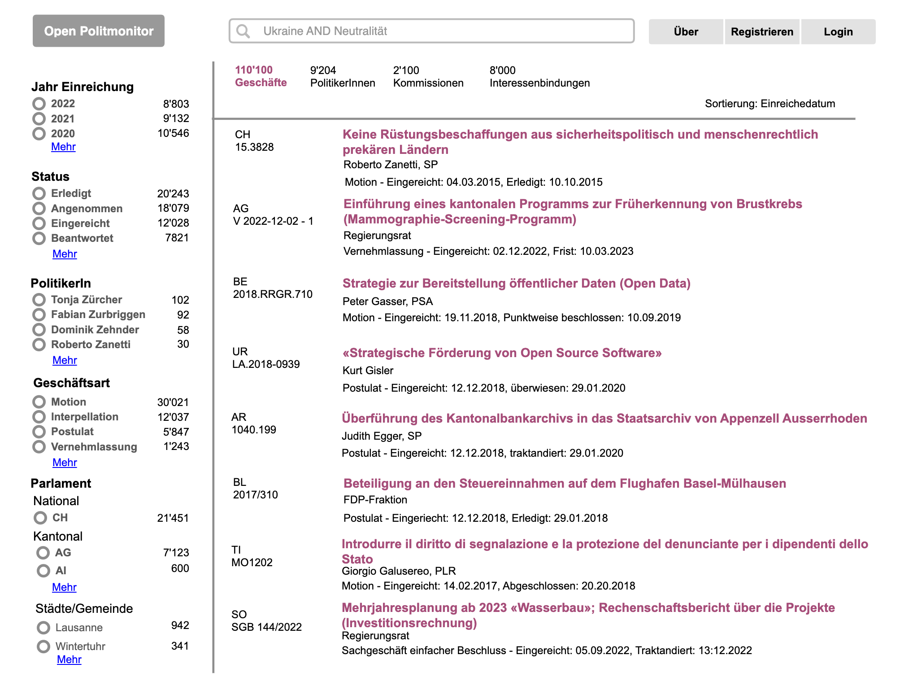

# Project Outline

## Organisational Setup

Formation of an association?
- Sponsorship 
Join existing structure: politools.net, opendata.ch?
Memorandum of Agreement, Example: ROR: https://ror.org/documents/ROR-Memorandum-of-Agreement-2022.pdf

## Server, Database, Website

- Setup 2 Server
	- Test
	- Productive
- Maria DB or Postgres DB (available as Docker Image)
- [Apache Hop](https://hop.apache.org/) (available as Docker Image) - For Crawling and ETL
- [Splash](https://splash.readthedocs.io/en/stable/index.html) - For Crawling (Rendering JS)
- CMS Software TBD (Wordpress?) - For Website
- API Software TBD - For Offering API

## Crawling / Import Pipelines

- Create initial database structure (Stage and Pool)
- Set up workflow to import/crawl data from parliaments on a daily frequency.
- Migrate existing pipelines from POLITmonitor for Pentaho Data Integration to Apache Hop.
- Remove as far as possible or as far as necessary adjustments in the ETL process just relevant for POLITmonitor.

## Set Up API

Set up an API that provides access to the data in the Pool.

## Portal / GUI

- Create a portal where the data can be searched and filtered by entities: 

### Fulltext

The Portal will provide a fulltext search to metadata and indexed documents.  

### Alerts

On the detail page of an affair, users can subscribe for updates of a single affair.

### Lists

Users can create can organize affairs in own lists. (Requires a login)

### Labels & Comments

Users can add own labels and comments to affairs (Requires Login). The labels and comments are either stored only privately or publicly.

### Calendar Functions

See upcoming affairs on the agenda

### AI Summaries of affairs

Add a Summary of an affair given the metadata and documents generated with AI

### Visualizations

Offer Visualization about the whole dataset with drilldowns to invidiual parliaments

## Data Quality Issues & Harmonizations

### Missing Open Data / Missing Standard

In 2022, the Federal Statistical Office asked in a [survey](https://www.bfs.admin.ch/bfs/de/home/dienstleistungen/ogd/dokumentation.gnpdetail.2022-0702.html) in which subject area too little data is available as OGD (Open Government Data). The area of "politics, political transparency" was mentioned most frequently. Parliamentary data was explicitly mentioned in 5% of the responses. As of now only a handful of parliaments (e.g. [BS](https://data.bs.ch/explore/?sort=modified&q=grosser+rat&refine.keyword=Grosser+Rat), [TG](https://data.tg.ch/explore/?q=Grossen+Rat&sort=title&refine.keyword=Grosser+Rat&refine.keyword=Kantonsparlament+), and [ZH](https://opendata.swiss/fr/dataset/web-service-des-geschaftsverwaltungssystems-des-kantonsrates-des-kantons-zurich)) publish their data explicitly as Open Data. 

And if they do so, the data is still heterogenous as there is no standard format how to publish parliamentary data. Although some cantons and cities use the same software as a council information system, e.g. [CMI](https://cmiag.ch/) typlically hosted by [i-web.ch](https://www.i-web.ch/gemweb), these instances are heavily customised to local needs (eg. type of affairs, parliamentary procedures) and offer little standardisation on closer examination.

One aim of this project is also to seek dialogue with parliaments in order to

- a) put the publication of open data on the agenda and
- b) to explore the interest and possibilities of defining a common output format for publishing parliamentary data. 

The planned creation of an open portal for all Swiss parliamentary data may also create a positive incentive for parliaments to make data available in a standardized format, as this creates direct and tangible added value and benefits.

However, without being a software service provider for the cantons and cities ourselves or without a mandate to ensure harmonisation, our efforts can "only" be an offer that depends heavily on the will and capacities of the parliaments. It can be assumed that hardly all parliaments will make their data available as open data and in standardised form in the foreseeable future.

Accordingly, the idea is to move forward with an "alliance of the willing" so that they make their data available in a harmonised format and standard, i.e. open data. To this end, the open portal will develop a general import for the newly defined standard, which will replace the previous crawling import. Crawling will however remain in place for the other parliaments. 

### Persons

The collection and harmonization of data from politicians of different levels (national, cantonal, municipal), different groups (legislative, executive), different time periods (legislations) leads to the problem of ambiguity. As of now, there's no standard identifier ([see discussion in PID Forum](https://pidforum.org/t/pids-for-parliamentarians-and-political-candidates/1025/4)), that goes beyond the scope of one parliament:

Example Erich Hess:

| council          | id                               |
|------------------|----------------------------------|
| Nationalrat      | [4163](https://www.parlament.ch/de/Seiten/ViewCouncillor.aspx?CouncillorId=4163)                             
| Grosser Rat Bern | [0a4555c040a3402990d64502ea529969](https://www.gr.be.ch//de/start/grosser-rat/mitglieder/mitgliedersuche/mitgliederdetail.html?guid=0a4555c040a3402990d64502ea529969) |
| Stadtrat Bern    | [62e838cc5d38430ea363dde4c8103694](https://ris.bern.ch/Mitglied.aspx?obj_guid=62e838cc5d38430ea363dde4c8103694) |

Therefore, a software-supported mechanism is to be created that recognizes potentially identical persons and proposes them for merging into one identity. 

The so created identity should then be published to Wikidata (eg. Wikidata entry of Erich Hess: [https://www.wikidata.org/wiki/Q121862](https://www.wikidata.org/wiki/Q121862)), where it can be connected to further identifiers and structured data.

### Status / Events

There is currently considerable variation in how parliaments publish information about the status and timeline of affairs. Obtaining structured information about whether an affair is closed or ongoing can already be challenging. While it is initially adequate to gather and output the status "as is," there is a need to explore methods for harmonizing the collected data. Furthermore, efforts should be made to engage in a dialogue with parliamentary bodies to determine which status information should be more readily accessible. 

## Automated Subject Classification

In addition to a fulltext search covering metadata and indexed documents, a language independent subject classification should be offered. In an Innosuisse-funded preliminary study, POLITmonitor and the BFH Institute for Public Sector Transformation examined the extent to which predefined or ad hoc topics (like Covid 19) can be derived using machine learning ([Mathoshi 2023](https://docs.fenceit.cloud/s/WqEaRJJEJ5Kb86Y)).

In light of the initial findings, it seems fitting to apply a two-tier classification system, like [the one](https://docs.fenceit.cloud/s/yYp4Kz8jmwE6pL7) developed and utilized by [année politque suisse](https://anneepolitique.swiss/).

The need for automatic classification is currently emerging in various places:

- The national parliament was looking for a [solution](https://www.bk.admin.ch/dam/bk/de/dokumente/dti/themen/veranstaltungen/Innovation_Challenge_DTI-SI.pdf.download.pdf/Innovation_Challenge_DTI-SI.pdf) as part of the fist [GovTech Innovation Fair 2023](https://www.admin.ch/gov/de/start/dokumentation/medienmitteilungen.msg-id-96479.html)
- The [politmonitor.bs.ch](https://politmonitor.bs.ch/home) uses a clustering by topics.
- The City Parliament of St. Gallen conducted a [challenge on topic extraction](https://hack.opendata.ch/project/1076) during the Open Data Hack St.Gallen 2023.
- In Zurich, a [pilot project](https://www.zh.ch/de/news-uebersicht/mitteilungen/2023/politik-staat/statistik/ki-pilotprojekt.html) was conducted to utilize AI-generated suggestions for allocating new submissions in the cantonal parliament to administrative units of the cantonal government.
- The Digital Administration Switzerland publishes [a list](https://www.digitale-verwaltung-schweiz.ch/aktuelles/politische-geschaefte) with national and cantonal affairs related to digitalization. This list is generate from POLITmonitor, where the subject "digitalization" is added manually to an affair.

In order to save resources and enable standardised clustering across several parliaments, an open service should be created that on a given input (documents of political affairs) can provide standardized or ad hoc generated subjects.

## Business Model

Intial Phase

- Intital Grant [Mercator](https://www.stiftung-mercator.ch/demokratie)?
- Intital Grant [DVS](https://www.digitale-verwaltung-schweiz.ch/ausschreibung2024)

Regular Phase

- Sponsorships from Cantons & Cities
- Features for Organisations (sharing lists, labels, comments?)
