# Overview Entities

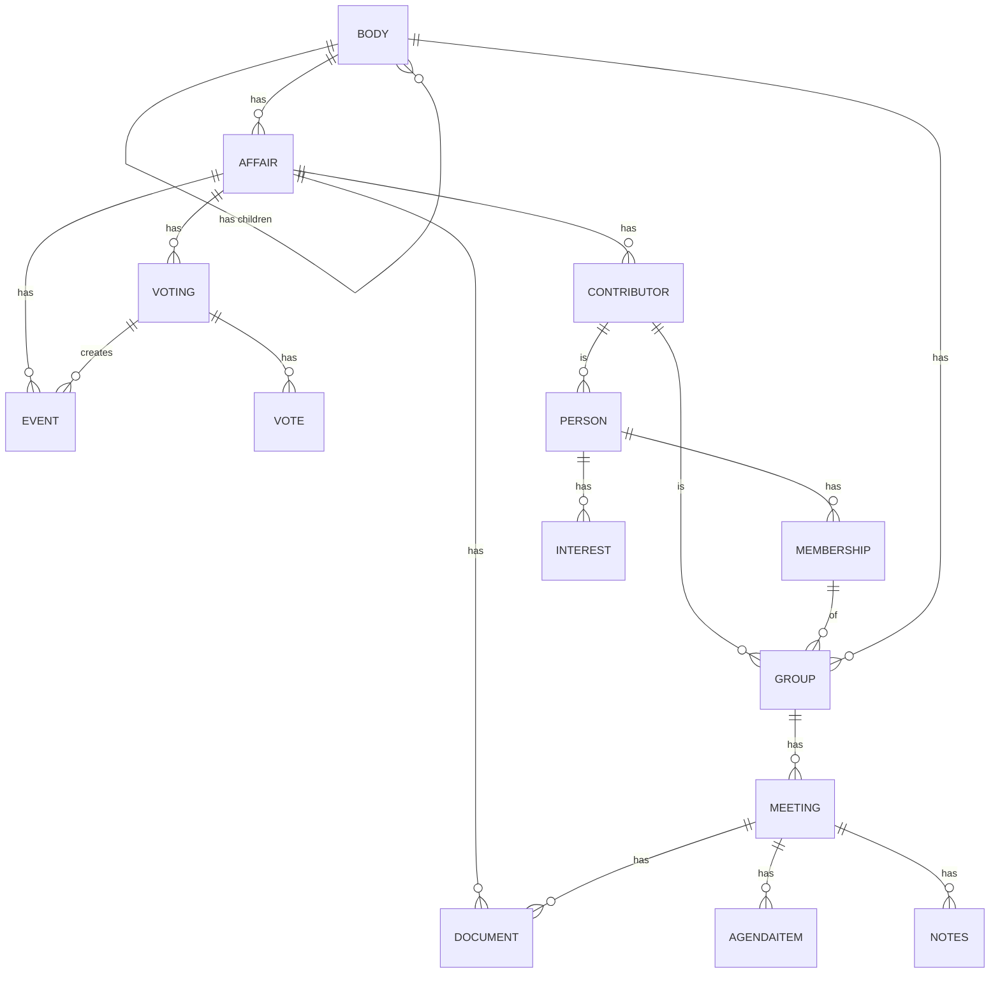

#  Entities Details - Remarks, Examples, Discussion

## BODY

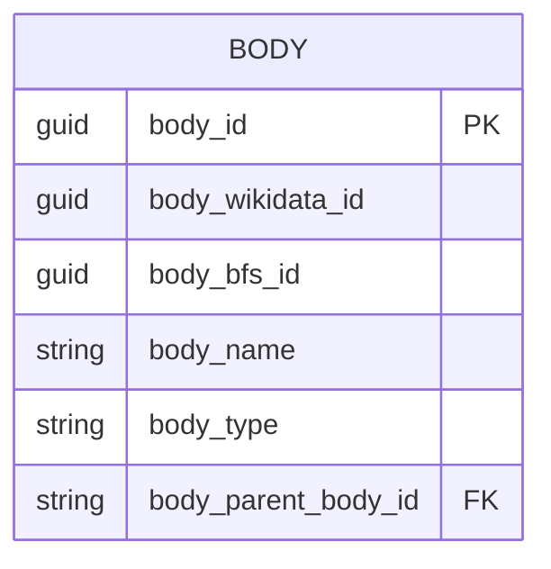
Hierarchy of country, cantons, muncipalities. For muncipalities the official directory can be used: https://www.bfs.admin.ch/bfs/de/home/dienstleistungen/forschung/api/api-gemeinde.html
### Relation: BODY - AFFAIR
* In a simple approach all affairs are attached to one body (all affairs of canton ZH, all of CH)
* One could also sympathize with a slightly more complex model and put a group between body and affair
  * All affairs of Kantonrat Zürich: https://www.kantonsrat.zh.ch/geschaefte?p=1
  * All affairs of Kantonsregierung Zürich: https://www.zh.ch/de/politik-staat/gesetze-beschluesse/beschluesse-des-regierungsrates.html
Unlike for canton Zurich, this boundary is often not that clear and given as affairs from the executive become input for the legislative and vice versa.

## GROUP
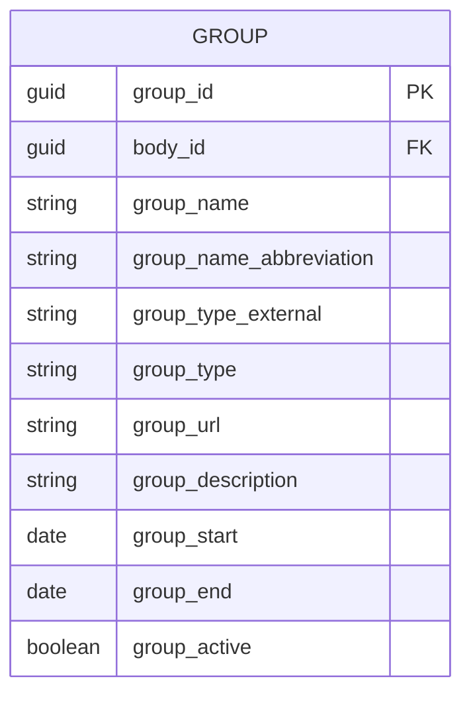
Possible Group Types:
* **party** (Partei)
* **parliamentary group** (Fraktion)
* **council legislative** (Ständerat, Nationalrat, Kantonsrat, Landrat, Einwohnerrat, Gemeinderat, Stadtrat etc.)
* **council executive** (Bundesrat, Regierungsrat, Gemeinderat, Stadtrat etc)
* **committee** (Finanzkommission, Interessengruppe, Delegation etc.)
* **committee ad hoc** (Spezialkommissionen, oder in manchen Kantonen wird pro Geschäft eine Kommission gebildet: z.B [VD](https://www.vd.ch/toutes-les-autorites/grand-conseil/depute-e-s/membre-du-grand-conseil/membre/280370#groups), [Vorberatende Kommissionen SG](https://www.ratsinfo.sg.ch/gremien?itemsPerPage=50&type=10&state=active&ordering=type.title&page=1)

## PERSON
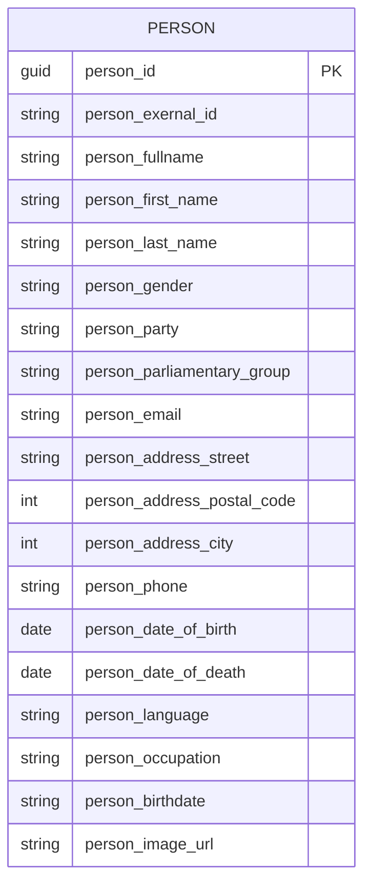
### Simplification
A person has one address, one email, one phone number only - Just store the latest, or do we want mutliple including historical data?
### Disambiguation
It's one thing to gather all persons from one parliament, another to disambigute them:
* Example Erich Hess:
    * Nationalrat: https://www.parlament.ch/de/Seiten/ViewCouncillor.aspx?CouncillorId=4163
    * Grosser Rat Bern: https://www.gr.be.ch//de/start/grosser-rat/mitglieder/mitgliedersuche/mitgliederdetail.html?guid=0a4555c040a3402990d64502ea529969
    * Stadtrat Bern: https://ris.bern.ch/Mitglied.aspx?obj_guid=62e838cc5d38430ea363dde4c8103694

## MEMBERSHIP
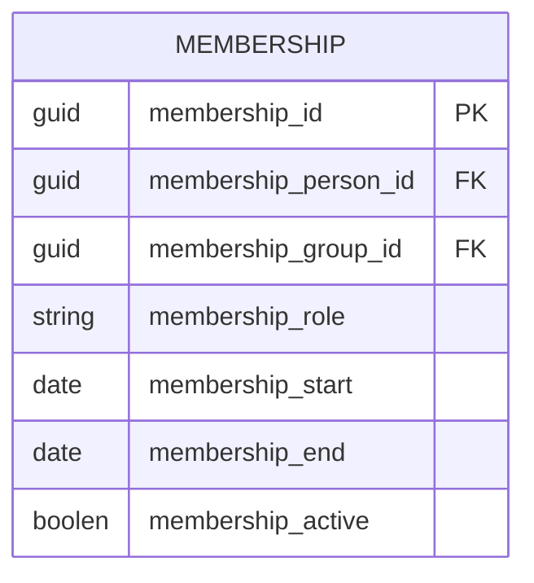
In many parliamentary information systems (especially those of https://cmiag.ch/), memberships are explicitly displayed and can be easily extracted. The membership of the of the council can be reasoned. In some cases the memberships of committees are only available in PDFs, e.g. [TG](https://parlament.tg.ch/organe/kommissionen/staendige-kommissionen/jk.html/12224)
### Start and End - Unclear
Often the start and end of a membership is not available in a structured form.

## INTEREST
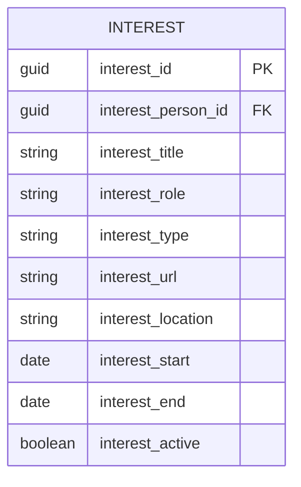
Parliaments that require their members to declare their interests sometimes provide more or less structure as to how this is to be done.
* Minimal: Simple list (one line per interest). Example: [AI](https://www.ai.ch/behoerdenmitglieder/fritsche-manser-patricia)
* Ususal: One line for multiple types like civil_activity, directorial activity, professional activity. Example: [BS](https://grosserrat.bs.ch/mitglieder/15004029-lukas-faesch)
* Maximal: Extra fields for role, location, type of organisation, start, end. Example: [CH](https://www.parlament.ch/de/%C3%BCber-das-parlament/parlamentsw%C3%B6rterbuch/parlamentsw%C3%B6rterbuch-detail?WordId=487)

## AFFAIR
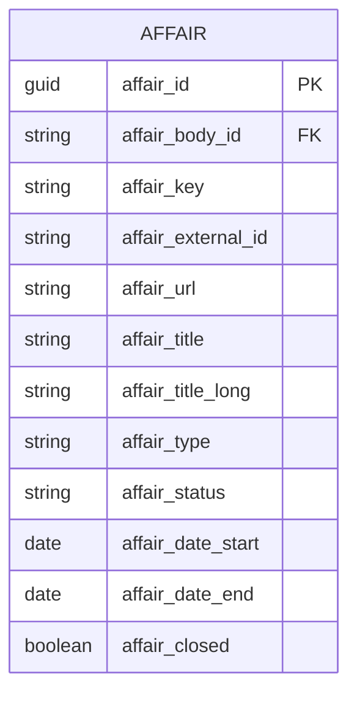
### affair_key
Most parliaments use systems that make use of at least 2 identifiers per affair.
* A technical id (affair_external_id) that might be an integer or a guid created and made for systems - usuall unique
* A short key (affair_key) made for humans to reference - sometimes not unique
  
| body | affair_key | affair_extern_id |
|---|---|---|
| OW | [32.23.12/33.23.06](https://www.ow.ch/politbusiness/106300) | 106300 |
| BE | [2023.RRGR.288](https://www.gr.be.ch/de/start/geschaefte/geschaeftssuche/geschaeftsdetail.html?guid=ff72ae475a3c45d8bc2ac07c98eea397) | ff72ae475a3c45d8bc2ac07c98eea397 |
| JU | [Initiatives parlementaires No 41](https://www.jura.ch/PLT/Interventions-parlementaires-deposees/Initiatives-parlementaires/Initiatives-parlementaires.html) | - |
| LU | [A 610](https://www.lu.ch/kr/parlamentsgeschaefte/detail?ges=9607d8e286904c1c8df0aec1016ba62c) | 9607d8e286904c1c8df0aec1016ba62c |
| GR | [No affair_key](https://ris.gr.ch/?language=de#/geschaefte/geschaeft/c94b9c4fc495459092a204d23ab64dce) | [c94b9c4fc495459092a204d23ab64dce](https://ris.gr.ch/?language=de#/geschaefte/geschaeft/c94b9c4fc495459092a204d23ab64dce) |

Experience shows that the affair_key is in some cases is not unique. The same key can be given for different affair types or affairs of different legislation periods. To make it unique on the parliament level one has to add a prefix for the type or the legislation. Examples:
| body | affair_key (original) | affair_key (adjusted for uniqueness) | external_id |
|---|---|---|---|
| LU | [A 506](https://www.lu.ch/kr/parlamentsgeschaefte/detail?ges=adcfaec76b5c4dc6a84d533ee01f3264) | 2021A 506 | adcfaec76b5c4dc6a84d533ee01f3264 |
| LU | [A 506](https://www.lu.ch/kr/parlamentsgeschaefte/detail?ges=13c4abb64cd647ad96a9f83dfb21aeaa) | 2018A 506 | 13c4abb64cd647ad96a9f83dfb21aeaa |
| TI | [1643](https://www4.ti.ch/poteri/gc/ricerca-messaggi-e-atti/ricerca/risultati/dettaglio?user_gcparlamento_pi8%5Battid%5D=108698&cHash=764bc770811676fa1972f45c8e17a4b1&user_gcparlamento_pi8[ricerca]=1643) | MO 1643| 764bc770811676fa1972f45c8e17a4b1 |
| TI | [1643](https://www4.ti.ch/poteri/gc/ricerca-messaggi-e-atti/ricerca/risultati/dettaglio?user_gcparlamento_pi8%5Battid%5D=89056&cHash=630bf929124689d9b6ca36ff955cd794&user_gcparlamento_pi8[ricerca]=1643) | INT 1643 | 630bf929124689d9b6ca36ff955cd794 |

In rare cases, but just frequently in cantonal **consultations**, there is neither a clear technical nor affair identifier. The closest to something like an identifier is then the date, which is also not necessary unique. Examples:
* BS [Vernehmlassungen](https://www.regierungsrat.bs.ch/geschaefte/vernehmlassungen.html)
* SO [Vernehmlassungen](https://so.ch/regierung/vernehmlassungen/)
* JU [Projet de Lois](https://www.jura.ch/Projets-de-lois/Textes-adoptes.html)

### affair_url
The majority of all parliamentary systems provide a URL for an affair to link to. But there are also cases where this is not so easy. Examples:
* GE: Information about an affair is spread over several documents and protocols. The best URL to an affairis a search: [M 2384](https://ge.ch/grandconseil/search?search=M+2384)
* VD: Information to an affair is mainly provided via short snippets and links in meeting agendas (Ordre du jour):
    * [Agenda Item 20_HQU_29](https://www.vd.ch/toutes-les-autorites/grand-conseil/seances-du-grand-conseil/point-seance/id/3019c8b6-e41c-46ab-a6f3-14e4865fbf4c/meeting/1000535)
    * Actually there is something like a affair page for [20_HQU_29](https://www.vd.ch/toutes-les-autorites/grand-conseil/depute-e-s/detail-objet/objet/20_HQU_29/membre/308334) available as a subsite of the author
* Bellinzona: Affairs have no individual link, but are [part of one large page](https://www.bellinzona.ch/index.php?node=876&lng=1&rif=76f856dddb).
* JU: Affairs are [listet with the initial text only](https://www.jura.ch/PLT/Interventions-parlementaires-deposees/Interventions-parlementaires-deposees.html).

### title vs. composite title
Some parliaments expose the title of an affair as composite of several attributes. Examples:

| Affair_Number | Exposed Title | Actual Title Only (needs to be extracted) |
|---|---|---|
| [UR LA.2023-0685](https://www.ur.ch/politbusiness/106831) | Motion Flavio Gisler, Schattdorf, für eine Standesinitiative für mehr Sicherheit am Axen | Für eine Standesinitiative für mehr Sicherheit am Axen |
| [SZ 2023.0376](https://www.sz.ch/behoerden/kantonsrat/geschaefte/geschaeft-detailseite.html/8756-8758-8799-9210-9211/geschaeft_guid/8a273a58f1804564ad5a02db00a5496f) | Kleine Anfrage KA 27/23: SOB-Bahnübergang in Wollerau – Sofortmassnahmen! | SOB-Bahnübergang in Wollerau – Sofortmassnahmen! |
| [AG 23.77](https://www.ag.ch/grossrat/grweb/de/195/Detail%20Gesch%C3%A4ft?ProzId=5892745) | Postulat Lelia Hunziker, SP, Aarau (Sprecherin), Alain Burger, SP, Wettingen, vom 14. März 2023 betreffend Umsetzung von Gleichstellung in der Steuererklärung von verheirateten Paaren | Umsetzung von Gleichstellung in der Steuererklärung von verheirateten Paaren |
| [GL 2023-42](https://www.gl.ch/parlament/landrat/geschaeftsdetails.html/240/geschaeft_guid/1d39eec1a53947039d10ac028b635298) | Memorialsantrag Bauerngruppe Glarus Süd «Für eine faire Abgeltung der Tierhalter» | Für eine faire Abgeltung der Tierhalter |

To create a unity here, it seems to make sense to extract the actual title (affair_title) and put the original title in an additional field (affair_title_long). With certain titles, you can't avoid extracting important information from the title anyway. In the mentioned example [AG 23.77](https://www.ag.ch/grossrat/grweb/de/195/Detail%20Gesch%C3%A4ft?ProzId=5892745) the author is only mentioned in the title (and not separately on the detail page).

### affair_status
For many parliaments, the status of an affair is explicitly stated ([AG](https://www.ag.ch/grossrat/grweb/de/195/Detail%20Gesch%C3%A4ft?ProzId=5981910)) or can at least be identified as ongoing or completed based on a search or the location of the top page in CMS (eg. [GL Aktuelle Geschäfte / Archiv](https://www.gl.ch/parlament/landrat/geschaefte/aktuelle-geschaefte.html/241)).

In some parliaments, however, sometimes only the initial text is published without the result ever being displayed on the same page. This is because the course of the process can ultimately only be seen in the minutes or other documents. Examples:

JU: https://www.jura.ch/PLT/Interventions-parlementaires-deposees/Interventions-parlementaires-deposees.html

## CONTRIBUTOR
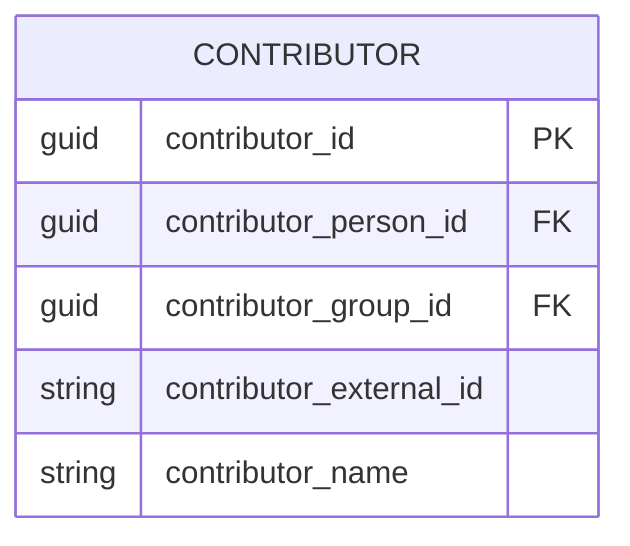

An affair has one or more contributors of either type person or type group (eg. Fraktion, Regierungsrat, Kommission, Amt). Contributors may have specific roles (eg. Erstunterzeichner, Mitunterzeichner, Sprecher). Many parliaments only provide the first 1-3 author in a structured manner.

## DOCUMENT
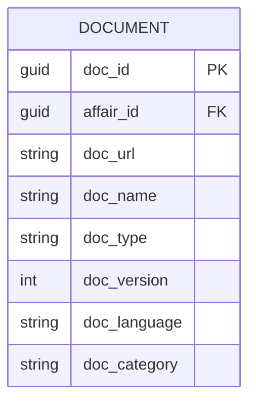

An affair has zero or more documents. The PDF format is still very commmon for most parliaments, though there are some parliaments that have started to publish texts as HTML (eg. [VD](https://www.vd.ch/toutes-les-autorites/grand-conseil/seances-du-grand-conseil/point-seance/id/3019c8b6-e41c-46ab-a6f3-14e4865fbf4c/meeting/1000535)). A document may also be a recording of the debate. 

### debates
In particular with the upcoming use of transcription software like [mediaparl.ch](https://mediaparl.ch/), that can provide links from text to video, the publishing moves rapidly away from PDF to HTML (eg. [BS Frontend](https://bs.recapp.ch/shareparl/), [BS Backend JSON](https://bs.recapp.ch/viewer/api/shareparl/segments?agendaItemUid=650149ae6a0868703cc5a4e6_6&ios=false&language=de)). S

May it make sense to specifiy a detailed schema for debates only?

## EVENT
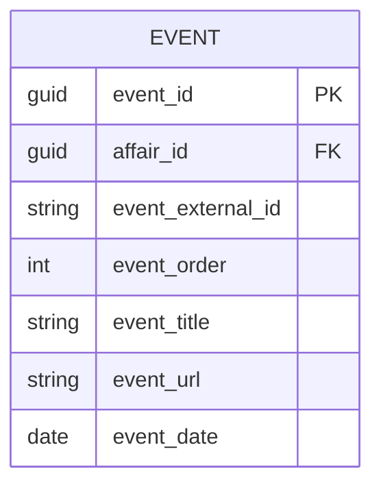

Possible types of events:
* Submitted (eingereicht)
* Transfered (überwiesen)
* Responded (beantwortet)
* Accepted (angenommen)
* on agenda (traktandiert)
* Rejected (abgelehnt)
* Withdrawn (zurückgezogen)

Many parliaments use a local terminology that can be mapped to some "standard types" of events. However there are various ways where and how this information is stored and displayed (sometimes in the name of a document, as part of a session protocol, sometimes in a larger event text). 

## VOTING
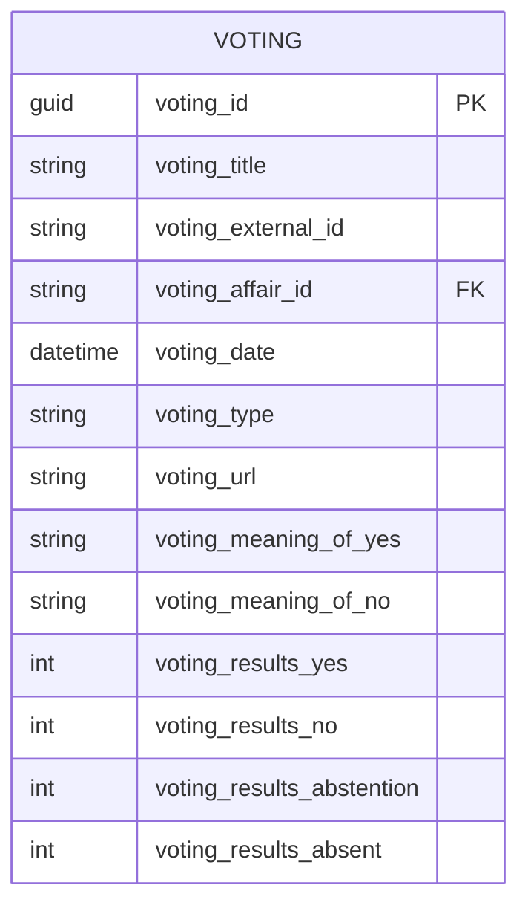

A voting may is or is not related to an affair. In many cantons the voting system is a seperate system, and therefore it can be a real challenge to relate the voting to an specific affair. The voting provides a summary of the total of votes (yes, no, abstention, absent), as well as the specific meaning of yes and no. Besides a question this might also be Option (Suggestion A or Suggestion B).

Examples: [VS](https://parlement.vs.ch/app/de/search/vote/185045), [SG](https://www.ratsinfo.sg.ch/api/votings/4983), [TI](https://www4.ti.ch/fileadmin/POTERI/GC/votazioni/5479_2.pdf), [BL](https://baselland.talus.ch/de/politik/cdws/abstimmung.php?aid=03a858a2c9934b46944a74f4c5092d88), [Overview Slides](https://docs.fenceit.cloud/s/S2XenpRfEF22n5A)

## VOTE
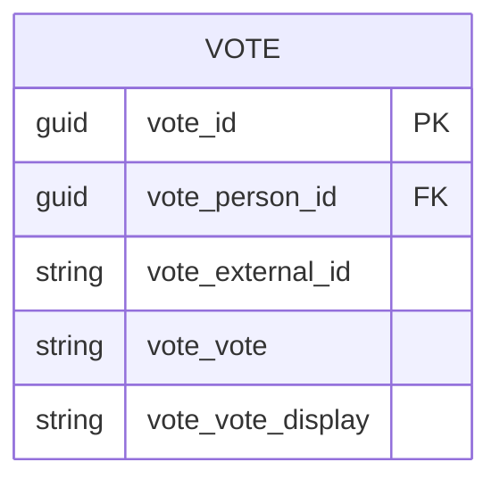

The Votes are the specific yes, no, abstention, absent values of each member of parliament that belong to a voting.

## MEETING
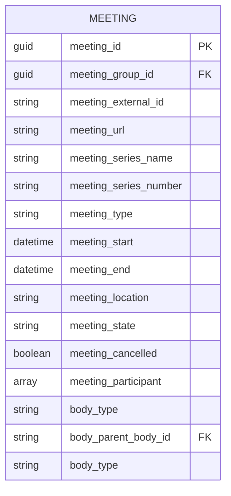

A Meeting or Session has information about date, time, place,

Example: [VS](https://parlement.vs.ch/api/fe/v1/parl_session?id=175258), [FR](https://www.parlinfo.fr.ch/de/sessionen/sitzung/?show=all), [GR](https://ris.gr.ch/cdws/Index/TRAKTANDUM/searchdetails?q=seq%3E0&l=de-CH&s=1&m=1000)

## AGENDAITEM

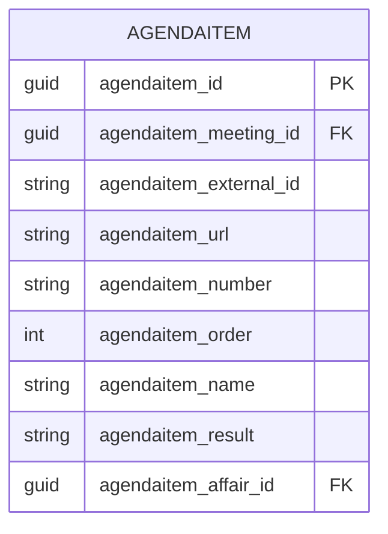

# General Issues

## Multilingualism

How to deal with languages

Examples:

* BE:
    * https://www.rrgr-service.apps.be.ch/api/gr/instances/585199c5-e188-44cb-b514-f143ada83635/render?guid=685c3d93f51f44de84c40ccb55a03e9a&lang=fr
    * https://www.rrgr-service.apps.be.ch/api/gr/instances/585199c5-e188-44cb-b514-f143ada83635/render?guid=685c3d93f51f44de84c40ccb55a03e9a&lang=de
* VS:
    * https://parlement.vs.ch/api/fe/v1/parl_process?id=185982&locale=fr
    * https://parlement.vs.ch/api/fe/v1/parl_process?id=185982&locale=de
* GR: 
    * https://ris.gr.ch/cdws/Index/GESCHAEFT/searchdetails?q=seq%3E0&l=de-CH&s=1&m=1000

## Tracking Changes & Archiving

Some parliaments provide access to information about former members and maintain the links in the systems. Others simply remove this informations and sometimes even create 404 errors in their own systems. Examples: [VD](https://www.vd.ch/toutes-les-autorites/grand-conseil/seances-precedentes/annee-2019/seance-du-mardi-12-novembre-2019): Link to Weissert, Podio etc., [AG](https://www.ag.ch/grossrat/grweb/de/164/Ratsmitglieder?ResetBreadCrumbs=T): No information about former members available, Coverage in Timewayback Machine also weak, as the website relys heavly on cookies to access).

## Collecting vs. Providing data

Should the model be used to collect information from multiple parliaments, or should it be more in the direction of OParl to provide a standard for how parliaments can publish their data as OGD.
Depending on this, more information is needed, or more thought can be given to mapped and harmonized data.

