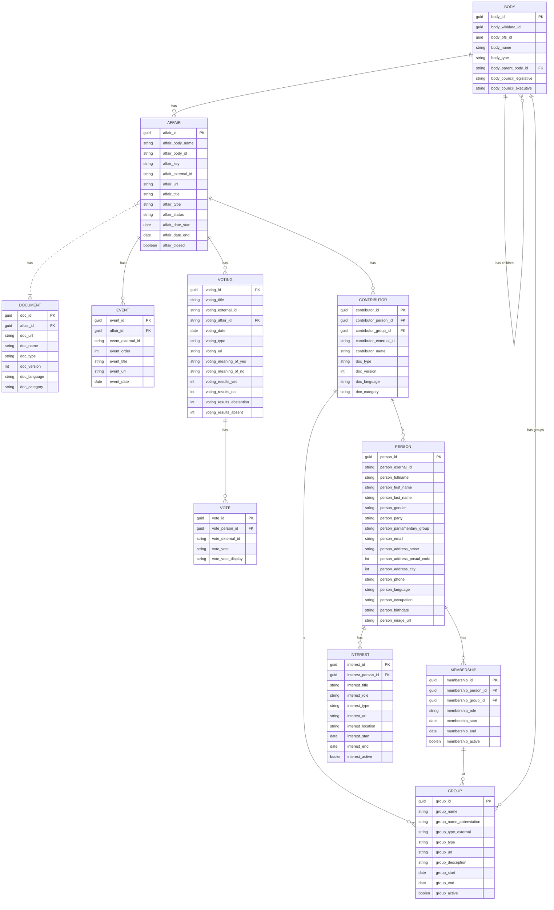

# Overview

# Entities

## BODY

Hierarchy of country, cantons, muncipalities. For muncipalities the official directory can be used: https://www.bfs.admin.ch/bfs/de/home/dienstleistungen/forschung/api/api-gemeinde.html

### Relation: BODY - AFFAIR

* In a simple approach all affairs are attached to one body (all affairs of canton ZH, all of CH)
* One could also sympathize with a slightly more complex model and put a group between body and affair
  * All affairs of Kantonrat Zürich: https://www.kantonsrat.zh.ch/geschaefte?p=1
  * All affairs of Kantonsregierung Zürich: https://www.zh.ch/de/politik-staat/gesetze-beschluesse/beschluesse-des-regierungsrates.html
Unlike for canton Zurich, this boundary is often not that clear and given as affairs from the executive become input for the legislative and vice versa.

## GROUP

Possible Group Types:
* **party** (Partei)
* **Parliamentary group** (Fraktion)
* **council legislative** (Ständerat, Nationalrat, Kantonsrat, Landrat, Einwohnerrat, Gemeinrat, Stadtrat etc.)
* **council executive** (Bundesrat, Regierungsrat, Gemeinderat, Stadtrat etc)
* **committee** (Finanzkommission, Interessengruppe, Delegation etc.)
* **committee ad hoc** (Spezialkommissionen, oder in manchen Kantonen wird pro Geschäft eine Kommission gebildet: z.B [VD](https://www.vd.ch/toutes-les-autorites/grand-conseil/depute-e-s/membre-du-grand-conseil/membre/280370#groups), [Vorberatende Kommissionen SG](https://www.ratsinfo.sg.ch/gremien?itemsPerPage=50&type=10&state=active&ordering=type.title&page=1)

 ## PERSON

- Simplification?: A person has one address, one email, one phone number only

## MEMBERHSHIP

Difficulty: Often the start and end of a membership is not available

