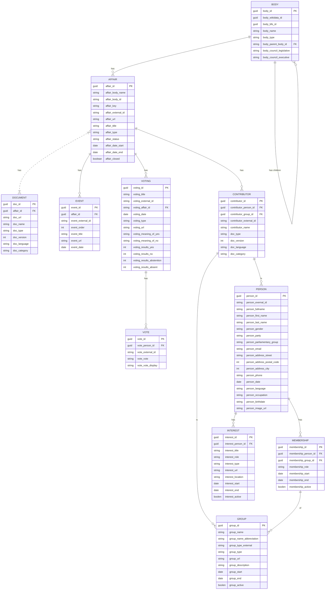

```mermaid
erDiagram
    AFFAIR }|..|{DOCUMENT : has
    AFFAIR ||--o{ EVENT : has
    AFFAIR ||--o{ CONTRIBUTOR : has
    AFFAIR ||--o{ VOTING : has
    VOTING ||--o{ VOTE : has
    CONTRIBUTOR ||--o{ PERSON : is
    CONTRIBUTOR ||--o{ GROUP : is
    PERSON ||--o{ MEMBERSHIP : "has"
    MEMBERSHIP ||--o{ GROUP : "of"
    PERSON ||--o{ INTEREST : has
    BODY ||--o{ AFFAIR : has
    BODY ||--o{ BODY : "has children"


       
        AFFAIR {
            guid affair_id PK
            string affair_body_name
            string affair_body_id
            string affair_key
            string affair_external_id
            string affair_url
            string affair_title
            string affair_type
            string affair_status
            date affair_date_start
            date affair_date_end
            boolean affair_closed
          }
        EVENT {
            guid event_id PK
            guid affair_id FK
            string event_external_id
            int event_order
            string event_title
            string event_url
            date event_date
            }

        DOCUMENT {
            guid doc_id PK
            guid affair_id FK
            string doc_url
            string doc_name
            string doc_type
            int doc_version
            string doc_language
            string doc_category
            }

        CONTRIBUTOR {
            guid contributor_id PK
            guid contributor_person_id FK
            guid contributor_group_id FK
            string contributor_external_id
            string contributor_name
            string doc_type
            int doc_version
            string doc_language
            string doc_category
            }
        PERSON {
            guid person_id PK
            string person_exernal_id
            string person_fullname
            string person_first_name
            string person_last_name
            string person_gender
            string person_party
            string person_parliamentary_group
            string person_email
            string person_address_street
            int person_address_postal_code
            int person_address_city
            string person_phone
            date person_date
            string person_language
            string person_occupation
            string person_birthdate
            string person_image_url
            }


        MEMBERSHIP {
            guid membership_id PK
            guid membership_person_id FK
            guid membership_group_id FK
            string membership_role
            date membership_start
            date membership_end
            boolen membership_active
            }

        GROUP {
            guid group_id PK
            string group_name
            string group_name_abbreviation
            string group_type_external
            string group_type
            string group_url
            string group_description
            date group_start
            date group_end
            boolen group_active
            }

         INTEREST {
            guid interest_id PK
            guid interest_person_id FK
            string interest_title
            string interest_role
            string interest_type
            string interest_url
            string interest_location
            date interest_start
            date interest_end
            boolen interest_active
            }

        VOTING {
            guid voting_id PK
            string voting_title
            string voting_external_id
            string voting_affair_id FK
            date voting_date
            string voting_type
            string voting_url
            string voting_meaning_of_yes
            string voting_meaning_of_no
            int voting_results_yes
            int voting_results_no
            int voting_results_abstention
            int voting_results_absent
            }

        VOTE {
            guid vote_id PK
            guid vote_person_id FK
            string vote_external_id
            string vote_vote
            string vote_vote_display
            }

        BODY {
            guid body_id PK
            guid body_wikidata_id
            guid body_bfs_id
            string body_name
            string body_type
            string body_parent_body_id FK
            string body_council_legislative
            string body_council_executive
            }

```
