# Overview

```mermaid
erDiagram
    AFFAIR ||--o{ DOCUMENT : has
    AFFAIR ||--o{ EVENT : has
    AFFAIR ||--o{ CONTRIBUTOR : has
    AFFAIR ||--o{ VOTING : has
    VOTING ||--o{ VOTE : has
    CONTRIBUTOR ||--o{ PERSON : is
    CONTRIBUTOR ||--o{ GROUP : is
    PERSON ||--o{ MEMBERSHIP : "has"
    MEMBERSHIP ||--o{ GROUP : "of"
    PERSON ||--o{ INTEREST : has
    BODY ||--o{ AFFAIR : has
    BODY ||--o{ BODY : "has children"
    BODY ||--o{ GROUP : "has"
    VOTING ||--o{ EVENT : creates
    GROUP ||--o{ MEETING : "has"
    MEETING ||--o{AGENDAITEM: "has"
    MEETING ||--o{NOTES: "has"
    MEETING ||--o{DOCUMENT: "has"

        BODY {
            guid body_id PK
            guid body_wikidata_id
            guid body_bfs_id
            string body_name
            string body_type
            string body_parent_body_id FK
            }
       
        AFFAIR {
            guid affair_id PK
            string affair_body_id FK
            string affair_key
            string affair_external_id
            string affair_url
            string affair_title
            string affair_title_long
            string affair_type
            string affair_status
            date affair_date_start
            date affair_date_end
            boolean affair_closed
          }
        EVENT {
            guid event_id PK
            guid affair_id FK
            string event_external_id
            int event_order
            string event_title
            string event_url
            date event_date
            }

        DOCUMENT {
            guid doc_id PK
            guid affair_id FK
            string doc_url
            string doc_name
            string doc_type
            int doc_version
            string doc_language
            string doc_category
            }

        CONTRIBUTOR {
            guid contributor_id PK
            guid contributor_person_id FK
            guid contributor_group_id FK
            string contributor_external_id
            string contributor_name
            string doc_type
            int doc_version
            string doc_language
            string doc_category
            }
        PERSON {
            guid person_id PK
            string person_exernal_id
            string person_fullname
            string person_first_name
            string person_last_name
            string person_gender
            string person_party
            string person_parliamentary_group
            string person_email
            string person_address_street
            int person_address_postal_code
            int person_address_city
            string person_phone
            date person_date_of_birth
            date person_date_of_death
            string person_language
            string person_occupation
            string person_birthdate
            string person_image_url
            }


        MEMBERSHIP {
            guid membership_id PK
            guid membership_person_id FK
            guid membership_group_id FK
            string membership_role
            date membership_start
            date membership_end
            boolen membership_active
            }

        GROUP {
            guid group_id PK
            guid body_id FK
            string group_name
            string group_name_abbreviation
            string group_type_external
            string group_type
            string group_url
            string group_description
            date group_start
            date group_end
            boolean group_active
            }

         INTEREST {
            guid interest_id PK
            guid interest_person_id FK
            string interest_title
            string interest_role
            string interest_type
            string interest_url
            string interest_location
            date interest_start
            date interest_end
            boolean interest_active
            }

        VOTING {
            guid voting_id PK
            string voting_title
            string voting_external_id
            string voting_affair_id FK
            datetime voting_date
            string voting_type
            string voting_url
            string voting_meaning_of_yes
            string voting_meaning_of_no
            int voting_results_yes
            int voting_results_no
            int voting_results_abstention
            int voting_results_absent
            }

        VOTE {
            guid vote_id PK
            guid vote_person_id FK
            string vote_external_id
            string vote_vote
            string vote_vote_display
            }


        MEETING {
            guid meeting_id PK
            guid meeting_group_id FK
            string meeting_external_id
            string meeting_url
            string meeting_series_name
            string meeting_series_number
            string meeting_type
            datetime meeting_start
            datetime meeting_end
            string meeting_location
            string meeting_state
            boolean meeting_cancelled
            array meeting_participant
            string body_type
            string body_parent_body_id FK
            string body_type

            }

        AGENDAITEM {
            guid agendaitem_id PK
            guid agendaitem_meeting_id FK
            string agendaitem_external_id
            string agendaitem_url
            string agendaitem_number
            int agendaitem_order
            string agendaitem_name
            string agendaitem_result
            guid agendaitem_affair_id FK
            }


```

# Entities - Remarks / Discussion

## BODY

Hierarchy of country, cantons, muncipalities. For muncipalities the official directory can be used: https://www.bfs.admin.ch/bfs/de/home/dienstleistungen/forschung/api/api-gemeinde.html

### Relation: BODY - AFFAIR

* In a simple approach all affairs are attached to one body (all affairs of canton ZH, all of CH)
* One could also sympathize with a slightly more complex model and put a group between body and affair
  * All affairs of Kantonrat Zürich: https://www.kantonsrat.zh.ch/geschaefte?p=1
  * All affairs of Kantonsregierung Zürich: https://www.zh.ch/de/politik-staat/gesetze-beschluesse/beschluesse-des-regierungsrates.html
Unlike for canton Zurich, this boundary is often not that clear and given as affairs from the executive become input for the legislative and vice versa.

## GROUP

Possible Group Types:
* **party** (Partei)
* **Parliamentary group** (Fraktion)
* **council legislative** (Ständerat, Nationalrat, Kantonsrat, Landrat, Einwohnerrat, Gemeinderat, Stadtrat etc.)
* **council executive** (Bundesrat, Regierungsrat, Gemeinderat, Stadtrat etc)
* **committee** (Finanzkommission, Interessengruppe, Delegation etc.)
* **committee ad hoc** (Spezialkommissionen, oder in manchen Kantonen wird pro Geschäft eine Kommission gebildet: z.B [VD](https://www.vd.ch/toutes-les-autorites/grand-conseil/depute-e-s/membre-du-grand-conseil/membre/280370#groups), [Vorberatende Kommissionen SG](https://www.ratsinfo.sg.ch/gremien?itemsPerPage=50&type=10&state=active&ordering=type.title&page=1)

 ## PERSON

- Simplification?: A person has one address, one email, one phone number only - Just store the latest, or do we want mutliple including historical data?
- 
- 

## MEMBERSHIP

Difficulty: Often the start and end of a membership is not available

## AFFAIR

### Affair_Key

Most parliaments use systems that make use of at least 2 identifiers per affair.

* A technical id (affair_external_id) that might be an integer or a guid created and made for systems - usuall unique
* A short key (affair_key) made for humans to reference - sometimes not unique

| body | affair_key | affair_extern_id |
|---|---|---|
| OW | [32.23.12/33.23.06](https://www.ow.ch/politbusiness/106300) | 106300 |
| BE | [2023.RRGR.288](https://www.gr.be.ch/de/start/geschaefte/geschaeftssuche/geschaeftsdetail.html?guid=ff72ae475a3c45d8bc2ac07c98eea397) | ff72ae475a3c45d8bc2ac07c98eea397 |
| JU | [Initiatives parlementaires No 41](Initiatives parlementaires No 41) |  |
| LU | [A 610](https://www.lu.ch/kr/parlamentsgeschaefte/detail?ges=9607d8e286904c1c8df0aec1016ba62c) | 9607d8e286904c1c8df0aec1016ba62c |

Experience shows that the affair_key is in some cases is not unique. The same key can be given for different affair types or affairs of different legislation periods. To make it unique on the parliament level one has to add a prefix for the type or the legislation.

Examples:

| body | affair_key (original) | affair_key (adjusted for uniqueness) | external_id |
|---|---|---|
| LU | [A 506](https://www.lu.ch/kr/parlamentsgeschaefte/detail?ges=adcfaec76b5c4dc6a84d533ee01f3264) | 2021A 506 | adcfaec76b5c4dc6a84d533ee01f3264 |
| LU | [A 506](https://www.lu.ch/kr/parlamentsgeschaefte/detail?ges=13c4abb64cd647ad96a9f83dfb21aeaa) | 2018A 506 | 13c4abb64cd647ad96a9f83dfb21aeaa |
| TI | [1643](https://www4.ti.ch/poteri/gc/ricerca-messaggi-e-atti/ricerca/risultati/dettaglio?user_gcparlamento_pi8%5Battid%5D=108698&cHash=764bc770811676fa1972f45c8e17a4b1&user_gcparlamento_pi8[ricerca]=1643) | MO 1643| 764bc770811676fa1972f45c8e17a4b1 |
| TI | [1643](https://www4.ti.ch/poteri/gc/ricerca-messaggi-e-atti/ricerca/risultati/dettaglio?user_gcparlamento_pi8%5Battid%5D=89056&cHash=630bf929124689d9b6ca36ff955cd794&user_gcparlamento_pi8[ricerca]=1643) | INT 1643 | 630bf929124689d9b6ca36ff955cd794 |

### title vs title_long

Some parliaments expose the title of an affair as composite of several attributes, Example:

| Affair_Number | Exposed Title | Actual Title Only (needs to be extracted) |
|---|---|---|
| [UR LA.2023-0685](https://www.ur.ch/politbusiness/106831) | Motion Flavio Gisler, Schattdorf, für eine Standesinitiative für mehr Sicherheit am Axen | Für eine Standesinitiative für mehr Sicherheit am Axen |
| [SZ 2023.0376](https://www.sz.ch/behoerden/kantonsrat/geschaefte/geschaeft-detailseite.html/8756-8758-8799-9210-9211/geschaeft_guid/8a273a58f1804564ad5a02db00a5496f) | Kleine Anfrage KA 27/23: SOB-Bahnübergang in Wollerau – Sofortmassnahmen! | SOB-Bahnübergang in Wollerau – Sofortmassnahmen! |
| [AG 23.77](https://www.ag.ch/grossrat/grweb/de/195/Detail%20Gesch%C3%A4ft?ProzId=5892745) | Postulat Lelia Hunziker, SP, Aarau (Sprecherin), Alain Burger, SP, Wettingen, vom 14. März 2023 betreffend Umsetzung von Gleichstellung in der Steuererklärung von verheirateten Paaren | Umsetzung von Gleichstellung in der Steuererklärung von verheirateten Paaren |
| [GL 2023-42](https://www.gl.ch/parlament/landrat/geschaeftsdetails.html/240/geschaeft_guid/1d39eec1a53947039d10ac028b635298) | Memorialsantrag Bauerngruppe Glarus Süd «Für eine faire Abgeltung der Tierhalter» | Für eine faire Abgeltung der Tierhalter |

To create a unity here, it seems to make sense to extract the actual title (affair_title) and put the original title in an additional field (affair_title_long). With certain titles, you can't avoid extracting important information from the title anyway. In the mentioned example [AG 23.77](https://www.ag.ch/grossrat/grweb/de/195/Detail%20Gesch%C3%A4ft?ProzId=5892745) the author is only mentioned in the title (and not separately on the detail page).

